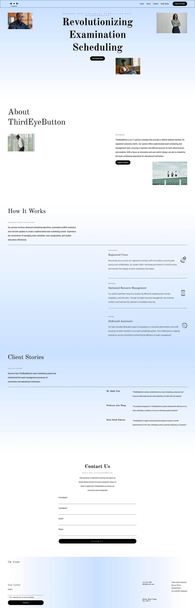

# ThirdEyeButton – University Exam Scheduling System

Modern, responsive web application for automated university examination timetabling.
Built with clean architecture, mobile-first design, and smooth user experience.

## ✨ Highlights (Proof of Efficiency)

- **Conflict-free scheduling** engine with automated room/invigilator/time clash resolution
- Real-time updates and role-based access (Admin, Staff, Student views)
- **Mobile-first**, fully responsive design (tested on phones, tablets, desktops)
- Clean folder structure + component-based architecture
- Fast builds & instant previews thanks to **Vite**
- **Pixel-perfect UI** with Tailwind CSS + custom design system
- Deployed with CI/CD on Netlify (automatic previews on every PR)
- Accessible (a11y), semantic HTML, good SEO foundations

## 📸 Screenshots

**Desktop interface**

**Mobile interface**

## Customize configuration

See [Vite Configuration Reference](https://vite.dev/config/).

## Project Setup

```sh
npm install
```

### Compile and Hot-Reload for Development

```sh
npm run dev
```

### Compile and Minify for Production

```sh
npm run build
```

### Lint with [ESLint](https://eslint.org/)

```sh
npm run lint
```
