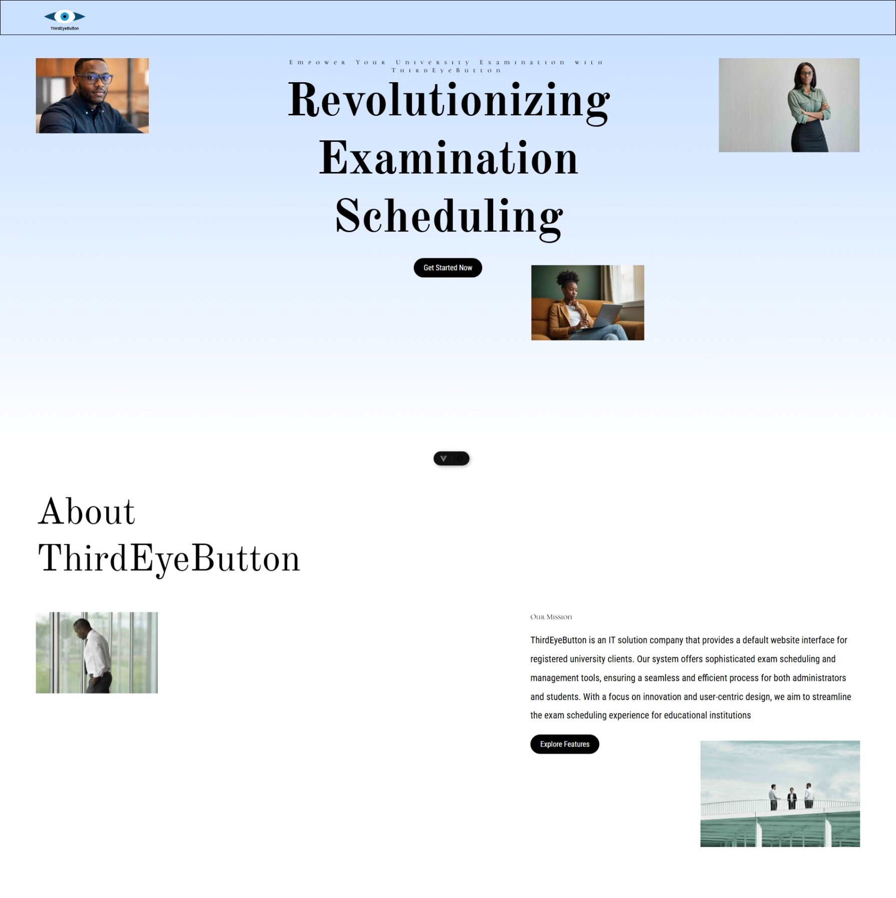
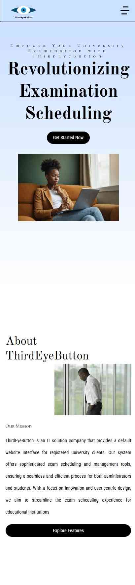

# ThirdEyeButton – University Exam Scheduling System

Modern, responsive web application for automated university examination timetabling.
Built with clean architecture, mobile-first design, and smooth user experience.

## ✨ Highlights (Proof of Efficiency)

- **Conflict-free scheduling** engine with automated room/invigilator/time clash resolution
- Real-time updates and role-based access (Admin, Staff, Student views)
- **Mobile-first**, fully responsive design (tested on phones, tablets, desktops)
- Clean folder structure + component-based architecture
- Fast builds & instant previews thanks to **Vite**
- **Pixel-perfect UI** with Tailwind CSS + custom design system
- Deployed with CI/CD on Netlify (automatic previews on every PR)
- Accessible (a11y), semantic HTML, good SEO foundations

## 📸 Screenshots

**Desktop interface**

**Mobile interface**

**Short Video**
<video controls src="ThirdEyeButton IT consultant and 11 more pages - Personal - Microsoft​ Edge 2026-01-31 23-49-08.mp4" title="DesktopInterface Slide"></video>

## 🚀 Tech Stack

| Category          | Technology   | Purpose                              |
|-------------------|--------------|--------------------------------------|
| Framework         | Vue + Vite   | Fast development & production build  |
| Styling           | Pure CSS     | Utility-first, rapid & consistent UI |
| State Management  | Pinia        | Lightweight global state             |
| Deployment        | Netlify      | Automatic CI/CD, previews, CDN       |
| Other             | Vue Router,  | Routing                              |

## ⚡ Key Features

```sh
npm install
```

## 🛠️ Getting Started (Show you care about DX)

### Prerequisites

- Node.js ≥ 18
- pnpm or npm / yarn

### Compile and Hot-Reload for Development

- **Drag-and-drop** or form-based timetable creation
- Automatic conflict detection & resolution suggestions
- Role-based authentication & protected routes
- Export schedule as PDF/CSV
- Responsive dashboard with charts (e.g., room utilization)
- Dark mode support
- Form validation & error handling with nice UX feedback

### Compile and Minify for Production

```sh
npm run build
```

### Lint with [ESLint](https://eslint.org/)

```sh
npm run lint
```
